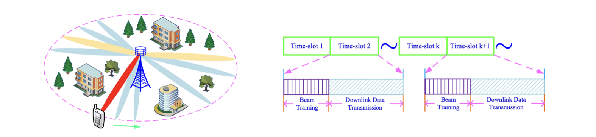

## Beam Alignment and Tracking for Millimeter Wave Communications via Bandit Learning

_Abstract:_ Millimeter wave (mmwave) communications have attracted increasing attention thanks to the abundant spectrum 
resource. The short wave-length of mmwave signals facilitates exploiting large antenna arrays to achieve large array 
gains and combat large path-loss. However, the use of large antenna arrays along with narrow beams leads to a large 
overhead in beam training for obtaining channel state information, especially in dynamic environments. To reduce the 
overhead of beam training, in this paper we formulate the problem of beam alignment and tracking (BA/T) as a stochastic 
bandit problem. In particular, to sense the change of the environments, the actions are designed based on the offset of 
successive beam indexes (i.e., beam index difference), which measures the rate of change of the environments. Then, we 
propose two efficient BA/T algorithms based on the stochastic bandit learning. To reveal useful insights, the performance 
of effective achievable rate is further analyzed for the proposed BA/T algorithms. The analytical results show that the 
algorithms can sense the change of the environments and adjust beam training strategies intelligently. In addition, they 
do not require any priori knowledge of dynamic channel modeling, and thus are applicable to a variety of complicated 
scenarios. Simulation results demonstrate the effectiveness and superiority of the proposed algorithms.

    An illustration of a point-to-point mmwave communication system and beam training in each time-slot.

